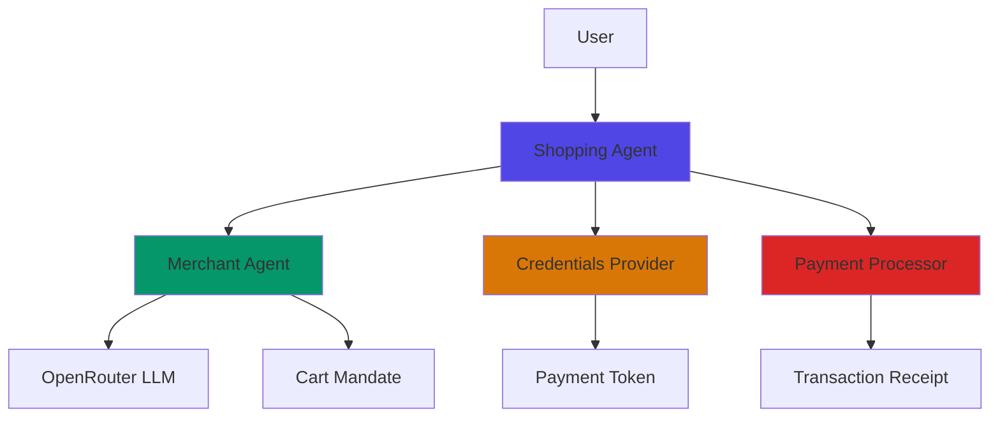

# AP2 Commerce Demo - Documentation

## Table of Contents

1. [Overview](#overview)
2. [Architecture](#architecture)
3. [Getting Started](./GETTING_STARTED.md)
4. [Frontend Documentation](./FRONTEND.md)
5. [Backend Documentation](./BACKEND.md)
6. [API Reference](./API_REFERENCE.md)
7. [User Guide](./USER_GUIDE.md)
8. [Development Guide](./DEVELOPMENT.md)

---

## Overview

**AP2 Commerce Demo** is a cutting-edge demonstration of the **Agent Payments Protocol (AP2)**, showcasing autonomous agent-based e-commerce transactions. The system enables intelligent shopping agents to discover products, negotiate prices, and complete secure payments on behalf of users with minimal human intervention.

### Key Features

- 🤖 **Autonomous Shopping Agents**: AI-powered agents handle product discovery and purchase workflows
- 🔐 **Secure Payment Mandates**: Cryptographically signed mandates ensure transaction integrity
- ⚡ **Auto-Purchase Mode**: Fully automated purchasing within user-defined budget limits
- 🎨 **Modern UI/UX**: Glassmorphism design with smooth animations and real-time agent logs
- 🔄 **Multi-Agent Architecture**: Specialized agents for shopping, merchant, credentials, and payment processing
- 📊 **Real-time Visualization**: Live agent communication logs and workflow timeline

### Technology Stack

#### Frontend
- **React 19** with TypeScript
- **Vite** for fast development and building
- **Tailwind CSS** for modern styling
- **Lucide React** for icons

#### Backend
- **Python 3.8+**
- **FastAPI** for REST API
- **OpenRouter LLM** (meta-llama/llama-3.3-70b-instruct) for intelligent product search
- **Uvicorn** ASGI server

### Project Structure

```
ap2-protocol-agent/
├── ap2-frontend/              # React frontend application
│   ├── src/
│   │   ├── components/        # React components
│   │   ├── api/              # API client
│   │   ├── hooks/            # Custom React hooks
│   │   └── styles/           # CSS styles
│   └── package.json
│
├── ap2_demo/                  # Python backend
│   ├── agents/               # Agent implementations
│   │   ├── shopping_agent.py
│   │   ├── merchant_agent.py
│   │   ├── credentials_provider_agent.py
│   │   └── payment_processor_agent.py
│   ├── mandates.py           # Mandate data structures
│   ├── server.py             # FastAPI server
│   └── main.py               # CLI demo
│
└── documentation/            # Project documentation
    ├── README.md
    ├── GETTING_STARTED.md
    ├── FRONTEND.md
    ├── BACKEND.md
    ├── API_REFERENCE.md
    ├── USER_GUIDE.md
    └── DEVELOPMENT.md
```

### System Architecture

The AP2 system follows a **multi-agent architecture** where specialized agents collaborate to complete e-commerce transactions:



### Quick Start

```bash
# Backend Setup
cd ap2_demo
pip install -r requirements.txt
cp .env.example .env  # Add your OPENROUTER_API_KEY
python server.py

# Frontend Setup (new terminal)
cd ap2-frontend
npm install
npm run dev
```

Visit `http://localhost:5173` to access the application.

---

## Documentation Index

- **[Getting Started](./GETTING_STARTED.md)** - Installation and setup instructions
- **[Frontend Documentation](./FRONTEND.md)** - React application architecture and components
- **[Backend Documentation](./BACKEND.md)** - Python agents and API implementation
- **[API Reference](./API_REFERENCE.md)** - Complete API endpoint documentation
- **[User Guide](./USER_GUIDE.md)** - How to use the application
- **[Development Guide](./DEVELOPMENT.md)** - Contributing and development workflow

---

## License

This project is a demonstration of the AP2 protocol and is provided for educational purposes.

## Support

For questions or issues, please refer to the documentation or contact the development team.
